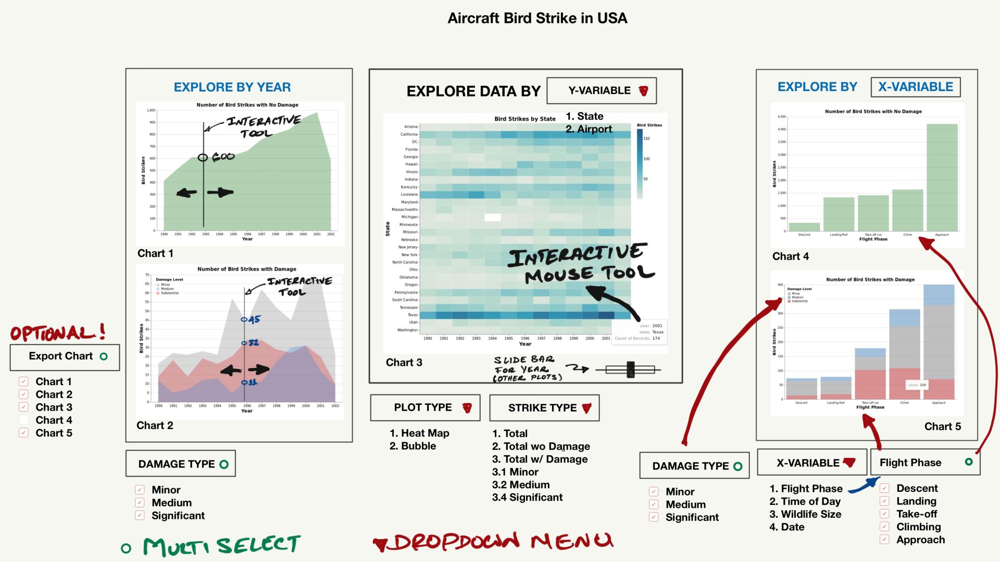

# DSCI 532 App Creation - Group 105

created by: Evhen Dytyniak, Tani Barasch, and Robert Pimentel  
  
### Description:  
  
The dashboard consists of 3 graphs arranged in two seperate tabs.

At the top left of the screen for each tab the damage types to be showen in the graphs can be selected (any combination of the 4 options). 

In the __"Bird Strikes by Factor"__ tab, there is a dropdown menue 'Factor' from which the X-axis variable for the bar chart can be chosen.
In this tab, the left graph shows the number of birdstrikes over time, with the different damage levels coluored. And on the right a bar chart showing the number of birdstrikes (Y axis) over one of three cetegories: 'Flight Phase', 'Time of Day', or "Bird Size".

In the __"Bird Strikes Location"__
A single heatmap that shows number of strikes over time (X axis) by location (Y axis), allowing location to either be the US state, or the airport from which the flight took off.

The graphs will focus on interactively representing the severity/number of bird strikes over several continuous and categorical variables (time, state, flight phase, etc.).

These graphs will be customizable across variables that may effect bird strikes:  

- One example is the ability to customize the time scale of the graphs; an example of this is switching between Year and Month along the X axis of the heatmap, allowing for a change over the year's perspective, or alternatively a yearly cycle perspective.  

- Another options is to highlight certain subgroups within the data, either by filtering out or highlighting in the colour of the relavent sub-groups. This will allow the user to visually see how the different factors/subgroups (times of day, flight phase, etc) relate to bird strikes.  
  
### Sketch:  

Original [project proposal](project_proposal.md).
